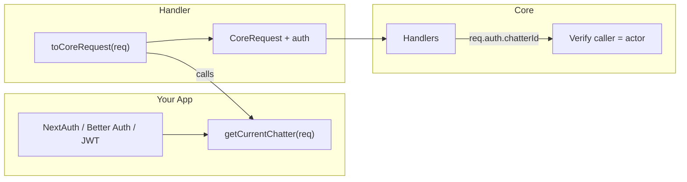

## Principle

Better Conversations does **not** embed an auth system. It receives an optional **auth context** (`chatterId`) injected by your app via a callback. Each HTTP handler (Next, Express, Hono, Fastify) accepts `getCurrentChatter(frameworkReq) => chatterId | null` and you implement it with your auth system (NextAuth, Better Auth, JWT, etc.).



## getCurrentChatter

When provided, the handler adapter calls your callback and attaches the result to the request as `auth: { chatterId }`. Handlers then verify that the caller matches the actor for sensitive actions.

| Handler | Verification (when req.auth present) |
|---------|-------------------------------------|
| `blocks.send` | `authorId === auth.chatterId` |
| `blocks.updateMeta` | `block.authorId === auth.chatterId` |
| `blocks.delete` | `block.authorId === auth.chatterId` |
| `conversations.create` | `createdBy === auth.chatterId` |
| `chatters/:id/conversations` | `params.id === auth.chatterId` |
| `policies/chatters/:id` (resolve, setChatter) | `params.chatterId === auth.chatterId` |

When `auth` is not present, no verification is performed (backward compatible).

## Integration Examples

### NextAuth

```ts title="app/api/conversation/[[...path]]/route.ts"
import { getServerSession } from "next-auth";
import { authOptions } from "@/lib/auth";
import { createNextHandler } from "@better-conversation/handler-next";
import { conv } from "@/lib/conversation";

const handler = createNextHandler(conv, {
  basePath: "/api/conversation",
  getCurrentChatter: async (req) => {
    const session = await getServerSession(authOptions);
    return (session?.user as { chatterId?: string })?.chatterId ?? null;
  },
});

export const GET = handler.GET;
export const POST = handler.POST;
export const PATCH = handler.PATCH;
export const DELETE = handler.DELETE;
```

### Better Auth

```ts title="lib/conversation-handler.ts"
import { auth } from "@/lib/auth";
import { createNextHandler } from "@better-conversation/handler-next";

getCurrentChatter: async (req) => {
  const session = await auth.api.getSession({ headers: req.headers });
  return (session?.user as { chatterId?: string })?.chatterId ?? null;
},
```

### JWT in Authorization header

```ts title="lib/conversation-handler.ts"
getCurrentChatter: async (req) => {
  const authHeader = req.headers.get("authorization");
  const token = authHeader?.replace(/^Bearer\s+/i, "");
  if (!token) return null;
  const payload = verifyJwt(token); // your JWT verification
  return payload.chatterId ?? null;
},
```

### Express with session

```ts title="app.ts"
createExpressHandler(conv, {
  basePath: "/api/conversation",
  getCurrentChatter: (req) => (req.session as { chatterId?: string })?.chatterId ?? null,
});
```

## Chatter ↔ User Mapping

Your auth system identifies **users**; Better Conversations identifies **chatters**. You need a mapping:

1. **Store chatterId on the user** — Add `chatterId` to your user model or session (e.g. `session.user.chatterId`). Create a Chatter on first login if needed.
2. **Table of liaison** — Maintain a `user_chatter` table: `userId -> chatterId`. Resolve in `getCurrentChatter` via a lookup.

## Policy and Security

When auth is enabled:

- **Policy** enforces what a chatter can do (send, edit, delete, rate limits) — see [Policy](/docs/policy).
- **Auth** ensures the HTTP caller is the chatter performing the action.
- **Permissions** handle admin/custom actions (archive, grant, etc.) — see [Permissions](/docs/permissions).
- **SecurityConfig** controls participant access and admin permission checks — see [Security](/docs/security).

The core applies `canEditOwnBlocks`, `editWindowSeconds`, `canDeleteOwnBlocks`, and blocks double-delete in `BlockService`. The `onBlockBeforeDelete` context includes `resolvedPolicy` and `authorCanDelete` for advanced use.

## requireAuth (optional)

To reject unauthenticated requests when you expect auth:

```ts
createNextHandler(conv, {
  basePath: "/api/conversation",
  getCurrentChatter: async (req) => { /* ... */ },
  requireAuth: true, // 401 if getCurrentChatter returns null
});
```

When `requireAuth: true` and `getCurrentChatter` returns `null`, the handler returns 401 before dispatching.

**Production recommendation:** Always use `requireAuth: true` and a real `getCurrentChatter` when deploying. The engine's `security.requireAuth` (default `true`) makes `requireAuthMatch` reject unauthenticated callers for sensitive handlers.
